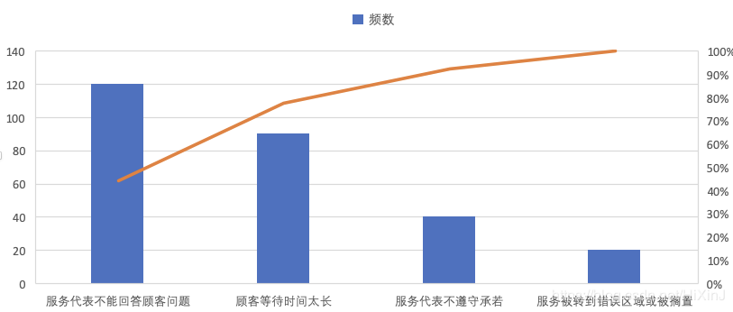
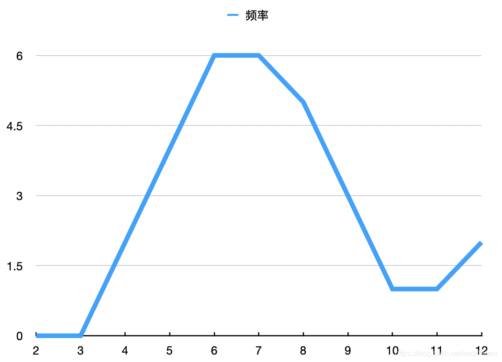

#### 1.

学位：博士

专业：对项目管理有所研究

教学经验：从事过有关项目管理的课程教学

学术成果：发表过有关项目管理的论文

#### 2.

| 顾客抱怨                     | 频数/周 |
| ---------------------------- | ------- |
| 服务代表不能回答顾客的问题   | 120     |
| 顾客等待时间太长             | 90      |
| 服务代表不遵守承诺           | 40      |
| 顾客被转移到错误区域或被搁置 | 20      |

#### 3.

标准差为2.13588

在一个标准差范围之内的有:(4+6+6+5+3)/30 = 80％

在两个标准差范围之内有: (0+2+4+6+6+5+3+1+1)/30 = 93.3%

显然大部分数据分布在两个标准差之间，主要聚集在点数7附近，故其能反映正态分布。